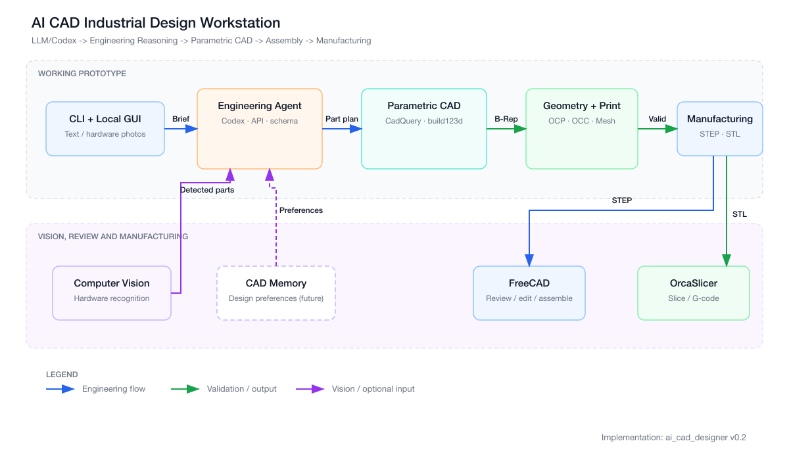

# PartPilot

开源的 AI 参数化 CAD 与 3D 打印制造工作流。项目把需求、硬件识别、工程
规划、参数化几何、装配、OpenCascade 验证、STEP/STL 导出和 FDM 制造检查
串成一条可复现链路。

Python 包名仍为 `ai-cad-designer`，仓库展示名使用 PartPilot。



## 能力

- `sensor_enclosure`、`desktop_robot`、`smart_fan` 三个已验证设计族；
- 本地 Codex、兼容 OpenAI Responses / Chat Completions API，以及确定性规则规划；
- PNG、JPEG、WebP 和 PDF 硬件资料识别，最多 6 个文件、单个最大 20 MB；
- 参数化零件、免螺丝接合、完整装配和半透明硬件参考件；
- OpenCascade、Trimesh、Open3D、BOM、装配干涉和构建空间检查；
- 可选 OrcaSlicer 实际切片，统计支撑、耗材、时间、桥接和拆除可达性；
- 本地 GUI：自动分析制造约束，分析失败时允许手工填写；
- 校准试片和接口测量回填，支持下一轮 CAD 生成。

Smart Fan 的当前设计边界和制造策略见
[Smart Fan 设计说明](docs/smart-fan-design.md)。

## 环境

项目使用 Python 3.12。推荐使用项目内的 `.venv`：

```bash
brew install micromamba
brew install --cask freecad orcaslicer

export AI_CAD_MAMBA_ROOT="$HOME/.local/share/ai-cad-mamba"
MAMBA_ROOT_PREFIX="$AI_CAD_MAMBA_ROOT" \
  micromamba create -y -p "$PWD/.venv" -f environment.yml
MAMBA_ROOT_PREFIX="$AI_CAD_MAMBA_ROOT" \
  micromamba run -p "$PWD/.venv" python -m pip install -e .
```

当前 `environment.yml` 固定 Python 3.12、CadQuery 2.7、OCP 7.8.1.1、
Open3D 0.19 和相关 CAD / 网格依赖。不要在 macOS ARM64 上把 PyPI 上的
同名占位包当作 OCP 安装。

## CLI

安装 editable package 后可使用 `ai-cad`；也可以直接调用模块。

检查环境和本地 Codex：

```bash
.venv/bin/python -m ai_cad_designer.cli status --planner codex
.venv/bin/python scripts/verify_environment.py
```

确定性规则规划：

```bash
.venv/bin/python -m ai_cad_designer.cli sensor --planner rules
.venv/bin/python -m ai_cad_designer.cli robot --planner rules
```

本地 Codex 规划：

```bash
.venv/bin/python -m ai_cad_designer.cli design \
  --planner codex \
  --request "Design a portable sensor enclosure, screwless and removable" \
  --output ai_cad_designer/exports/custom_design
```

硬件资料识别并生成 CAD：

```bash
.venv/bin/python -m ai_cad_designer.cli design \
  --planner codex \
  --image /absolute/path/hardware.jpg \
  --request "根据照片设计一个可拆卸 PETG 外壳" \
  --output ai_cad_designer/exports/vision_design
```

真实 OrcaSlicer 切片：

```bash
.venv/bin/python -m ai_cad_designer.cli design \
  --planner rules --slice \
  --request "为 Apple Mac mini M4 设计无螺丝 PETG 散热底座" \
  --output ai_cad_designer/exports/smart_fan
```

所有设计输出目录都包含提案、STEP/STL 和 JSON 验证报告；上传视觉资料时
还会包含 `hardware_analysis.json`。`--slice` 会额外生成切片报告和 3MF。

## GUI

```bash
.venv/bin/python -m ai_cad_designer.gui_server --host 127.0.0.1 --port 8765
```

打开 <http://127.0.0.1:8765>。服务只绑定 loopback，不向局域网暴露。

GUI 流程：

1. 填写设计需求；
2. 上传硬件照片、原理图或 PDF 并执行识别；
3. 自动分析并载入材料、公差、壁厚和层高，或手工填写；
4. 检查组件 L/W/H、确认不确定尺寸，再生成 CAD；
5. 查看真实 STL 预览、装配、验证、制造成本和下载文件。

外部 API 只从服务端环境变量读取，不进入浏览器：

```bash
export AI_CAD_API_BASE="https://api.openai.com/v1"
export AI_CAD_API_KEY="..."
export AI_CAD_API_MODEL="gpt-5.6-sol"
export AI_CAD_API_PROTOCOL="responses"
```

程序不会自动读取 `.env` 文件。兼容协议为 `responses` 和
`chat_completions`；外部端点需要支持图片输入和结构化 JSON，具体能力取决于
端点实现。

## 校准回填

GUI 结果会输出 `calibration_measurement_template.json`。填写实物试片结果后：

```bash
.venv/bin/python -m ai_cad_designer.cli design \
  --planner rules \
  --calibration-results path/to/calibration_measurement_template.json \
  --request "基于 smices/hw_smart_fan 为 Mac mini M4 设计底部智能散热底座" \
  --output ai_cad_designer/exports/smart_fan_calibrated
```

校准导入支持公差、圆角、电源键、风扇孔位、探头卡扣，以及前后接口 X/Z
残差。接口残差会叠加到当前工程参数，并以 `calibration_coupon` 标记。

## Python API

```python
from ai_cad_designer import (
    create_assembly,
    create_part,
    export_step,
    export_stl,
    generate_joint,
    validate_printability,
)

tray = create_part(
    "tray",
    (80, 50, 20),
    wall_thickness_mm=2.0,
    open_top=True,
)
snap = generate_joint("snap_fit", tolerance_mm=0.25)
assembly = create_assembly("prototype", [tray, snap.male])

export_step(tray, "ai_cad_designer/exports/tray.step")
export_stl(tray, "ai_cad_designer/exports/tray.stl")
print(validate_printability(tray))
```

## FreeCAD 与 OrcaSlicer

FreeCAD 的启动扩展位于 `freecad/AICADStartup`；可按需链接到用户的
FreeCAD Mod 目录：

```bash
mkdir -p "$HOME/Library/Application Support/FreeCAD/v1-1/Mod"
ln -s "$PWD/freecad/AICADStartup" \
  "$HOME/Library/Application Support/FreeCAD/v1-1/Mod/AICADStartup"
```

OrcaSlicer 最终仍需使用实际打印机、喷嘴、材料和温度配置。程序检查几何、
流形、水密性、壁厚和 220 mm 构建空间，但不替代最终切片预览与实物验证。

## 测试

```bash
.venv/bin/python -m compileall -q ai_cad_designer tests scripts freecad
.venv/bin/python -m pytest
```

测试覆盖核心几何、装配干涉、视觉工作流、GUI 资源、切片解析、支撑策略、
校准回填和 Smart Fan 工作流。

## 设计边界

- 没有标尺、明确型号或实测值时，视觉识别的尺寸只是估算；
- 解析载荷、强度、温升和切片结果不能替代实体 PETG 测试；
- `0.25 mm` 是默认设计公差，不保证所有打印机都能直接达到；
- LLM 输出是不可信输入，必须经过本地 schema、几何和制造门禁；
- 当前不伪造长期 CAD 偏好记忆。
